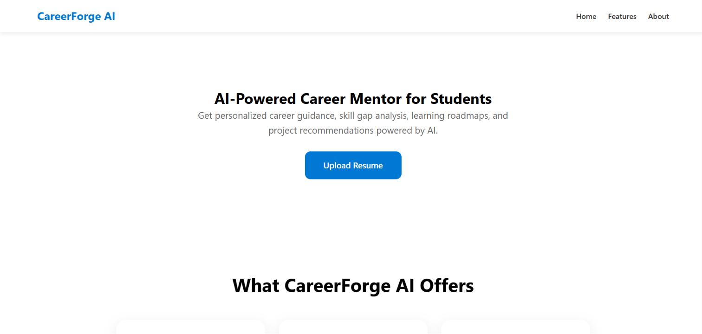
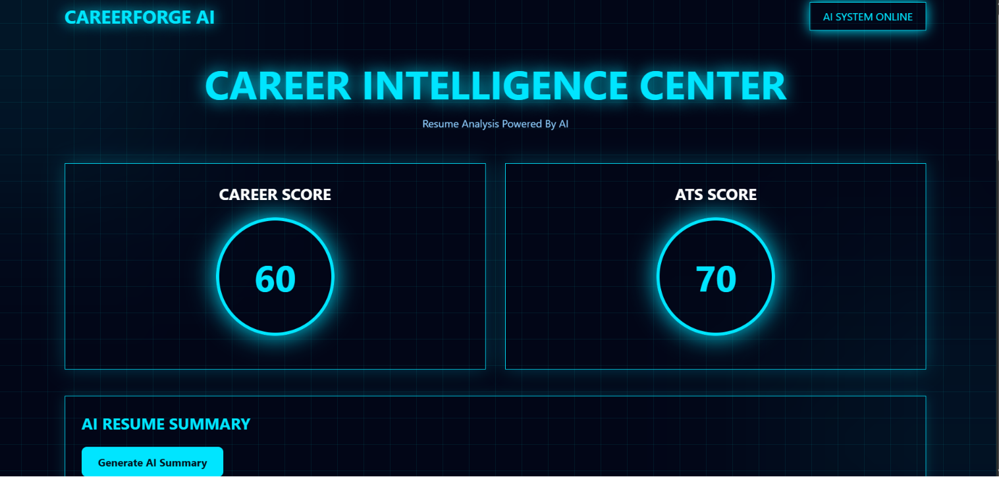

# 🚀 CareerForge AI

<div align="center">

### AI-Powered Resume Intelligence & Career Decision Platform

Transform resumes into actionable career intelligence using AI-powered document understanding, resume analytics, skill evaluation, and personalized career recommendations.


</div>

---

## 📖 Overview

**CareerForge AI** is an intelligent career analytics platform engineered to bridge the gap between traditional resumes and modern recruitment systems.

Leveraging **Microsoft Azure Document Intelligence**, the platform extracts structured information from resumes, evaluates candidate profiles using multiple AI-driven metrics, identifies skill deficiencies, predicts suitable career paths, and generates comprehensive professional reports.

The objective is to provide job seekers with data-driven insights that enhance employability while improving resume quality for Applicant Tracking Systems (ATS).

---

## ✨ Core Capabilities

### 📄 Intelligent Resume Parsing
- AI-powered resume extraction
- Structured candidate information
- Automatic skill identification
- Education & experience extraction

### 📊 Resume Intelligence
- ATS Compatibility Analysis
- Career Readiness Score
- Resume Quality Assessment
- AI-generated Professional Summary

### 🧠 AI Career Insights
- Skill Gap Identification
- Recommended Learning Areas
- Job Role Prediction
- Personalized Career Recommendations

### 🎯 Interview Preparation
- Domain-specific interview questions
- Technical & HR question generation
- Career roadmap suggestions

### 📑 Professional Reporting
- Automated PDF Report Generation
- Downloadable Resume Analysis
- Career Intelligence Report

---

# 🏗 System Workflow

```text
Resume Upload
      │
      ▼
Azure Document Intelligence
      │
      ▼
Resume Parsing
      │
      ▼
AI Analysis Engine
      │
      ├── ATS Score
      ├── Career Score
      ├── Resume Summary
      ├── Skill Gap Analysis
      ├── Job Role Prediction
      └── Interview Questions
      │
      ▼
Professional PDF Report
```

---

# 🛠 Technology Stack

| Category | Technologies |
|----------|--------------|
| Backend | Python, Flask |
| Frontend | HTML5, CSS3 |
| AI Service | Azure Document Intelligence |
| Document Processing | ReportLab |
| Deployment Ready | Flask Server |

---

# 📌 Key Features

- ✅ Resume Upload Interface
- ✅ AI Resume Parsing
- ✅ ATS Score Calculation
- ✅ Career Readiness Score
- ✅ AI Resume Summary
- ✅ Skill Gap Analysis
- ✅ Job Role Prediction
- ✅ Personalized Interview Questions
- ✅ Career Roadmap
- ✅ Downloadable PDF Report

---

# 📷 Screenshots

## 🏠 Home Page

<h3 align="center">Home page </h3>

<p align="center">
  
</p>

---

## 📤 Resume Upload

<h3 align="center">Upload page</h3>

<p align="center">
  
</p>

---

## 📊 Analytics Dashboard

<h3 align="center">Dashboard</h3>

<p align="center">
  
</p>

---

# 🚀 Future Roadmap

CareerForge AI is designed with scalability in mind. Planned enhancements include:

- 🤖 Azure OpenAI Integration
- 💬 AI Career Assistant Chatbot
- 🎯 Intelligent Job Match Analyzer
- 🧠 LLM-powered Resume Optimization
- 🎤 AI Interview Simulator
- 📈 Resume Version Comparison
- 🌐 LinkedIn Profile Analyzer
- 📝 Cover Letter Generator
- 🔍 Real-time Job Recommendation Engine
- 📚 Personalized Learning Roadmaps

---

# 🎯 Project Highlights

- Enterprise-inspired architecture
- AI-assisted career intelligence
- Modern resume analytics
- ATS-focused evaluation
- Scalable Flask backend
- Cloud-powered document understanding
- Automated professional reporting

---

# 👩‍💻 Author

### **Minal Sharma**

Aspiring AI Engineer passionate about building practical AI applications that solve real-world problems in career development, recruitment intelligence, and automation.

---

## ⭐ Support

If you found this project useful,

⭐ Star the repository

🍴 Fork it

💡 Contribute with ideas and improvements

---

<div align="center">

### Empowering Careers Through Artificial Intelligence

**CareerForge AI**

</div>


