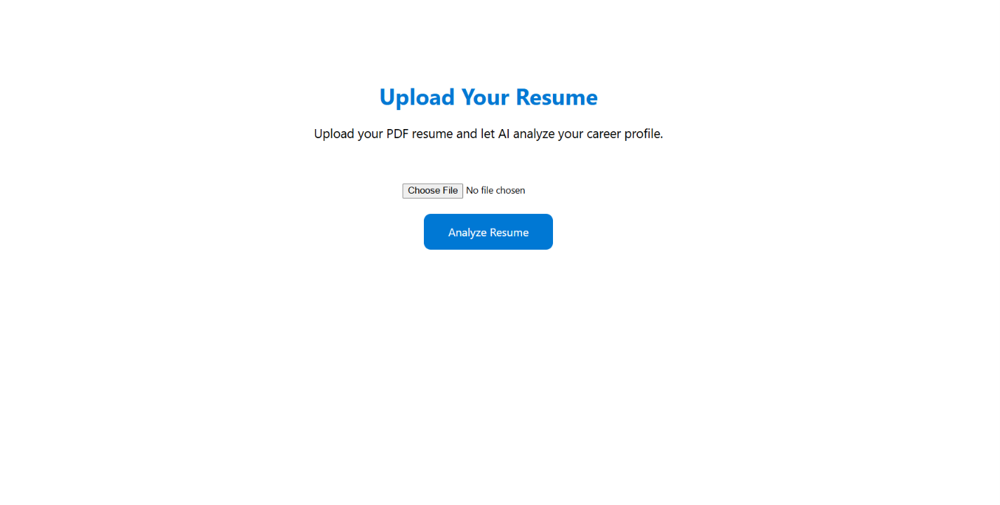

#  <h1 align="center"><b>🚀 CareerForge AI</b></h1>

<div align="center">

### AI-Powered Resume Intelligence & Career Decision Platform

Transform resumes into actionable career intelligence using AI-powered document understanding, resume analytics, skill evaluation, and personalized career recommendations.


</div>

---

##  Overview

**CareerForge AI** is an intelligent career analytics platform engineered to bridge the gap between traditional resumes and modern recruitment systems.

Leveraging **Microsoft Azure Document Intelligence**, the platform extracts structured information from resumes, evaluates candidate profiles using multiple AI-driven metrics, identifies skill deficiencies, predicts suitable career paths, and generates comprehensive professional reports.

The objective is to provide job seekers with data-driven insights that enhance employability while improving resume quality for Applicant Tracking Systems (ATS).

---

##  Platform Capabilities

### Resume Processing
- Extracts structured information from uploaded resumes using Azure Document Intelligence.
- Identifies candidate details, education, work experience, technical skills, and certifications.
- Converts unstructured resume documents into standardized data for further analysis.

---

### Resume Evaluation
- Calculates an Applicant Tracking System (ATS) compatibility score.
- Evaluates overall resume quality based on completeness and content structure.
- Generates a comprehensive candidate assessment report.

---

### Career Intelligence
- Analyzes technical skills to identify competency gaps.
- Predicts suitable job roles based on the extracted profile.
- Recommends improvement areas to strengthen career readiness.

---

### Interview Readiness
- Generates role-specific technical interview questions.
- Provides HR interview preparation questions.
- Suggests a structured learning roadmap aligned with the predicted career path.

---

### Reporting & Insights
- Presents analysis through an interactive dashboard.
- Generates a downloadable PDF report containing resume insights and evaluation metrics.
- Consolidates all recommendations into a single professional assessment document.

---


# ⚙️ System Workflow

```text
                           ┌────────────────────┐
                           │   User Uploads     │
                           │      Resume        │
                           └─────────┬──────────┘
                                     │
                                     ▼
                     ┌────────────────────────────────┐
                     │ Resume Validation & Processing │
                     └─────────┬──────────────────────┘
                               │
                               ▼
              ┌──────────────────────────────────────┐
              │ Azure Document Intelligence Service  │
              │  • OCR                              │
              │  • Layout Detection                 │
              │  • Entity Extraction                │
              └─────────┬────────────────────────────┘
                        │
                        ▼
             ┌─────────────────────────────────────┐
             │ Structured Resume Data Extraction   │
             │                                     │
             │ • Personal Details                  │
             │ • Education                         │
             │ • Skills                            │
             │ • Experience                        │
             │ • Certifications                    │
             └─────────┬───────────────────────────┘
                       │
                       ▼
              ┌────────────────────────────────────┐
              │    AI Analysis Engine              │
              └─────────┬──────────────────────────┘
                        │
      ┌─────────────────┼──────────────────┐
      │                 │                  │
      ▼                 ▼                  ▼
┌──────────────┐  ┌──────────────┐  ┌────────────────┐
│ ATS Analysis │  │ Career Score │  │ Resume Summary │
└──────────────┘  └──────────────┘  └────────────────┘
      │                 │                  │
      └─────────────────┼──────────────────┘
                        │
                        ▼
          ┌─────────────────────────────────┐
          │ Advanced Career Intelligence    │
          │                                 │
          │ • Skill Gap Analysis            │
          │ • Job Role Prediction           │
          │ • Interview Questions           │
          │ • Career Roadmap                │
          └──────────────┬──────────────────┘
                         │
                         ▼
          ┌─────────────────────────────────┐
          │ Professional Dashboard          │
          │                                 │
          │ • Visual Analytics              │
          │ • Career Insights               │
          │ • Download PDF Report           │
          └─────────────────────────────────┘
```


# 🛠 Technology Stack

| Category | Technologies |
|----------|--------------|
| Backend | Python, Flask |
| Frontend | HTML5, CSS3 |
| AI Service | Azure Document Intelligence |
| Document Processing | ReportLab |
| Deployment Ready | Flask Server |

---

# Feature Highlights

- **Resume Document Processing** — Parses PDF resumes into structured candidate data.
- **ATS Compatibility Assessment** — Evaluates resume performance against ATS-oriented criteria.
- **Career Readiness Evaluation** — Measures overall profile strength using multiple assessment metrics.
- **Professional Resume Summary** — Generates a concise overview of the candidate profile.
- **Skill Gap Identification** — Detects competency gaps and highlights improvement areas.
- **Role Recommendation Engine** — Predicts suitable job roles based on resume content.
- **Interview Preparation Support** — Generates role-specific technical and HR interview questions.
- **Career Development Roadmap** — Provides structured guidance for professional growth.
- **Interactive Analytics Dashboard** — Presents insights through a clean and intuitive interface.
- **Professional PDF Export** — Generates a comprehensive downloadable analysis report.

---

# Demo

<h3 align="center">Home page </h3>

<p align="center">
  
</p>

---

<h3 align="center">Upload page</h3>

<p align="center">
  
</p>

---


<h3 align="center">Dashboard</h3>

<p align="center">
  
</p>

---

#  Project Highlights

- Enterprise-inspired architecture
- AI-assisted career intelligence
- Modern resume analytics
- ATS-focused evaluation
- Scalable Flask backend
- Cloud-powered document understanding
- Automated professional reporting

---

#  Author

### **Minal Sharma**

Aspiring AI Engineer passionate about building practical AI applications that solve real-world problems in career development, recruitment intelligence, and automation.

---


If you found this project useful,

⭐ Star the repository

🍴 Fork it

💡 Contribute with ideas and improvements

---

<div align="center">

### Empowering Careers Through Artificial Intelligence

**CareerForge AI**

</div>


